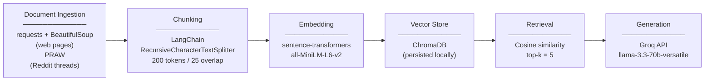

# Project 1 Planning: The Unofficial Guide

> Write this document before you write any pipeline code.
> Your spec and architecture diagram are what you'll use to direct AI tools (Claude, Copilot, etc.) to generate your implementation — the more specific they are, the more useful the generated code will be.
> Update the Retrieval Approach and Chunking Strategy sections if you change your approach during implementation.
> Update this file before starting any stretch features.

---

## Domain

Unofficial Guide to Popular Upper-Division CSE Electives at Stony Brook University

### Scope
Covers 8 commonly discussed CSE upper-division electies: CSE 303, CSE 306, CSE 312, CSE 316, CSE 320, CSE 337, CSE 373, and CSE 416. Focusing on student experiences with workload, difficulty, grading, professor teaching style and career usefulness. It also will include professor's information like research area or academic background to help students to understand professor's background better.

### Why is it useful
Unlike required courses, upper-division CSE electives give students more freedom, which also makes course selection harder. This guide helps students compare official course information with unofficial student reviews from sources like Reddit, Rate My Professors, and Coursicle before making enrollment decisions.

---

## Documents

<!-- List your specific sources: URLs, subreddit names, forum threads, or file descriptions.
     Aim for at least 10 sources that together cover different subtopics or perspectives within your domain. -->

| # | Source | Description | URL or location |
|---|--------|-------------|-----------------|
| 1 | SBU CS faculty page | Official list of CS faculty, titles, research/teaching areas | https://www.cs.stonybrook.edu/people/faculty |
| 2 | SBU CS undergraduate course list | Official CSE course numbers and titles | https://www.cs.stonybrook.edu/students/Undergraduate-Studies/csecourses |
| 3 | SBU Computer Science BS catalog | Degree requirements and course structure | https://catalog.stonybrook.edu/preview_program.php?catoid=11&poid=1411 |
| 4 | Rate My Professors CS professors | list of professor ratings across SBU CS major | https://www.ratemyprofessors.com/search/professors/971?q=*&did=11 |
| 5 | Rate My Professors — individual CSE professors | Ratings, difficulty, would-take-again, review text per class | https://www.ratemyprofessors.com/professor/2640556 |
| 6 | Professor Reviews on Coursicle | student reviews | https://www.coursicle.com/professors/ |
| 7 | Coursicle SBU CSE course pages | Student reviews and course descriptions for individual CSE courses | https://www.coursicle.com/stonybrook/courses/CSE/337/ |
| 8 | r/SBU "What does it take to pass CSE 320" | CSE 320 related information | https://www.reddit.com/r/SBU/comments/1osu0wo/what_does_it_take_to_pass_cse_320 |
| 9 | r/SBU "Questions about CSE 316" | CSE 316 related information | https://www.reddit.com/r/SBU/comments/1emwui9/questions_about_cse_316 |
| 10 | r/SBU "CSE320 and CSE 316" | Student advice about whether taking CSE 320 and CSE 316 together is manageable | https://www.reddit.com/r/SBU/comments/dqgcow/cse320_and_cse_316 |
| 11 | r/SBU "CSE Major Difficulty" | Broad student discussion about which upper-division CSE courses are difficult, including CSE 306, CSE 320, CSE 312, and CSE 373 | https://www.reddit.com/r/SBU/comments/ka92z6/cse_major_difficulty/ |
| 12 | r/SBU "What are the most useful CSE electives" | Student discussion about career usefulness and practical value of different CSE electives | https://www.reddit.com/r/SBU/comments/mouep1/what_are_the_most_useful_cse_electives |

---

## Chunking Strategy

<!-- How will you split documents into chunks?
     State your chunk size (in tokens or characters), overlap size, and explain why those
     numbers fit the structure of your documents.
     A review-heavy corpus warrants different chunking than a long FAQ. -->

**Chunk size:** 200 tokens

**Overlap:** 25 tokens

**Reasoning:** The corpus is dominated by short-form content — Reddit comments (~50–300 words each) and RMP/Coursicle reviews (~50–150 words each). Each comment or review is typically one student's complete opinion on a course, so 200 tokens is large enough to capture a full thought without merging multiple students' opinions into a single chunk. The 25-token overlap prevents a student's reasoning from being split at a chunk boundary. Another reason to capped the chunk size at 200 is because `all-MiniLM-L6-v2` has a maximum input limit of 256 tokens. Official pages (faculty bios, course descriptions) will produce multiple chunks in order, which is fine since retrieval can pull the most relevant one.

---

## Retrieval Approach

<!-- Which embedding model are you using (e.g., all-MiniLM-L6-v2 via sentence-transformers)?
     How many chunks will you retrieve per query (top-k)?
     If you were deploying this for real users and cost wasn't a constraint, what tradeoffs
     would you weigh in choosing a different embedding model — context length, multilingual
     support, accuracy on domain-specific text, latency? -->

**Embedding model:** `all-MiniLM-L6-v2` via `sentence-transformers`

**Top-k:** 5

**Production tradeoff reflection:** `all-MiniLM-L6-v2` is fast and lightweight, which makes it practical for this project, but in a real deployment I would consider OpenAI's `text-embedding-3-large`. The main tradeoffs are: (1) accuracy — `text-embedding-3-large` produces richer semantic representations that better capture student opinions (using slangs or not as formal/common describing words) (2) context length — `text-embedding-3-large` supports more tokens, useful if later want to embed longer contents without chunking them (3) cost — calling an external API per chunk adds network latency and per-token cost at scale, whereas `all-MiniLM-L6-v2` runs locally for free

---

## Evaluation Plan

<!-- List your 5 test questions with their expected correct answers.
     Questions should be specific enough that you can judge whether the system's response
     is right or wrong. "What are good dining halls?" is too vague.
     "What do students say about wait times at [dining hall name] during lunch?" is testable. -->

| # | Question | Expected answer |
|---|----------|-----------------|
| 1 | What do students say about the workload in CSE 320? | In the collected Reddit threads and reviews, multiple students describe CSE 320 as one of the most demanding courses — heavy C programming, low-level memory management projects, and a steep learning curve. Many warn it requires significantly more time than other electives. |
| 2 | Is it a good idea to take CSE 320 and CSE 316 at the same time? | Students generally advise against it. Reddit threads specifically about this combination warn that both courses are project-heavy and time-consuming, making the combined workload very difficult to manage in the same semester. |
| 3 | Which upper-division CSE electives do students say are the most useful for getting a job? | CSE 416 (Machine Learning) and CSE 337 (Statistical Computing with R) are most frequently cited for industry relevance, particularly for data science and ML roles. CSE 312 is also mentioned for its foundational value. |
| 4 | What do students say about the difficulty of CSE 306 compared to other electives? | CSE 306 (Operating Systems) is described as one of the hardest electives — students highlight complex systems programming, difficult projects, and a high time commitment relative to other courses in the major. |
| 5 | What do students say about whether CSE 316 is practical or project-based? | Students describe CSE 316 as more practical/project-oriented than theory-heavy, with emphasis on software development concepts, web/app development, and implementation work. Some students discuss whether prior experience with the course tech stack helps.|

---

## Anticipated Challenges

<!-- What could go wrong? Name at least two specific risks with reasoning.
     Consider: noisy or inconsistent documents, missing source attribution, off-topic
     retrieval, chunks that split key information across boundaries. -->

1. **Outdated or conflicting student opinions.** Reddit posts and RMP reviews span multiple years, and course content, grading policies, and professors change over time. A chunk from a 2019 Reddit thread may contradict a 2024 review for the same course. The system has no way to prefer recent sources, so it may confidently surface stale advice (like warning about professor no longer teaching the class).

2. **Vague or content-poor review chunks degrading retrieval quality.** Many RMP and Coursicle reviews are very short and generic (ex: "Great professor, I learned a lot!" or "Hard class, mid professor"). These produce weak embeddings that may rank highly on superficial keyword overlap but add no real information. They can take the place in the top-k results where some more specific, useful chunks are supposed to be.

---

## Architecture

<!-- Draw a diagram of your pipeline showing the five stages:
     Document Ingestion → Chunking → Embedding + Vector Store → Retrieval → Generation
     Label each stage with the tool or library you're using.
     You can use ASCII art, a Mermaid diagram, or embed a sketch as an image.
     You'll use this diagram as context when prompting AI tools to implement each stage. -->

---

## AI Tool Plan

<!-- For each part of the pipeline below, describe:
     - Which AI tool you plan to use (Claude, Copilot, ChatGPT, etc.)
     - What you'll give it as input (which sections of this planning.md, which requirements)
     - What you expect it to produce
     - How you'll verify the output matches your spec

     "I'll use AI to help me code" is not a plan.
     "I'll give Claude my Chunking Strategy section and ask it to implement chunk_text()
     with my specified chunk size and overlap" is a plan. -->

**Milestone 3 — Ingestion and chunking:**
Using Claude. I will give it the Documents table and the Chunking Strategy section from this file as context. I will ask it to implement two files: `ingest.py` (fetches each URL using `requests` + `BeautifulSoup` for web pages and `PRAW` for Reddit threads, saves raw text per source with metadata like URL and source name) and `chunk.py` (loads the raw text files and splits them using LangChain's `RecursiveCharacterTextSplitter` with `chunk_size=200` and `chunk_overlap=25`, outputs a list of chunk objects with text and source metadata). I will verify by printing the total chunk count, spot-checking that no chunk cuts off mid-sentence, and confirming that source metadata is preserved on each chunk.

**Milestone 4 — Embedding and retrieval:**
Using Claude. I will give it the Retrieval Approach section, the Architecture diagram, and the chunk output format from Milestone 3. I will ask it to implement `embed.py` (generates embeddings for all chunks using `sentence-transformers` `all-MiniLM-L6-v2` and stores them in a local ChromaDB collection with source metadata) and `retrieve.py` (accepts a query string, embeds it with the same model, and returns the top-5 most similar chunks with their text and source). I will verify by running the 5 evaluation questions as test queries and checking that the returned chunks are semantically relevant to each question.

**Milestone 5 — Generation and interface:**
Using Claude. I will give it the full `planning.md`, the output format of `retrieve.py`, and the 5 evaluation questions from the Evaluation Plan. I will ask it to implement `generate.py` (takes a user query + the top-5 retrieved chunks, constructs a prompt that instructs the Groq API to answer only based on the provided context and cite sources, and calls `llama-3.3-70b-versatile` via the Groq client) and `app.py` (a Gradio web UI that accepts a user question, calls retrieve then generate, and displays the answer with source citations). I will verify by manually running each of the 5 evaluation questions through the full pipeline and checking that answers match the expected responses in the Evaluation Plan.
